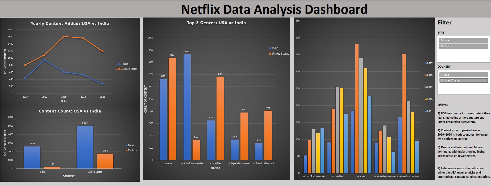

# 📊 Netflix Data Analysis using Excel

## 📌 Project Overview
This project analyzes the Netflix dataset using Microsoft Excel to extract meaningful insights and build an interactive dashboard.

---

## 🛠️ Tools Used
- Microsoft Excel  
- Pivot Tables  
- Data Cleaning  
- Data Visualization  

---

## 📸 Dashboard Preview

---

## 🔍 Key Analysis Performed
- Distribution of Movies vs TV Shows  
- Year-wise content growth  
- Genre-wise analysis  
- Country-wise content distribution  

---

## 🎯 Dashboard Features
- Interactive slicers (Year, Genre, Country)  
- KPI metrics (Total Titles, Movies, TV Shows)  
- Dynamic charts updating based on filters  

---

## 💡 Key Insights
- Movies dominate Netflix content over TV Shows  
- Content production increased significantly after 2015  
- USA contributes the highest number of titles  
- Certain genres are more popular globally  

---

## 💼 Business Recommendations

- The USA has the highest content contribution and strong audience demand. Netflix should continue investing in high-quality productions in the USA to maintain its dominance.

- India is an emerging market with growing demand for diverse and regional content. Increasing investment in Indian content can help capture a larger audience base.

- To improve global popularity, Netflix can balance content production by:
  - Expanding international content in India (regional movies, series, multilingual content)
  - Introducing more globally appealing content in the USA (diverse genres and international collaborations)

- There appears to be a gap in certain genres/regions. Netflix can identify underrepresented categories and produce targeted content to fill this gap and attract new audiences.
  
---

## 📂 Files Included
- `Netflix_Analysis.xlsx` → Complete Excel project  
- `dashboard_default.png` → Dashboard preview  
- Additional screenshots showing interactivity  

---

## 🚀 How to Use
1. Download the Excel file  
2. Open in Microsoft Excel  
3. Use slicers to explore the dashboard interactively  

---
